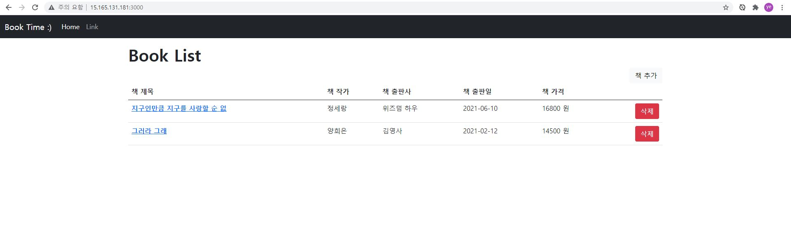
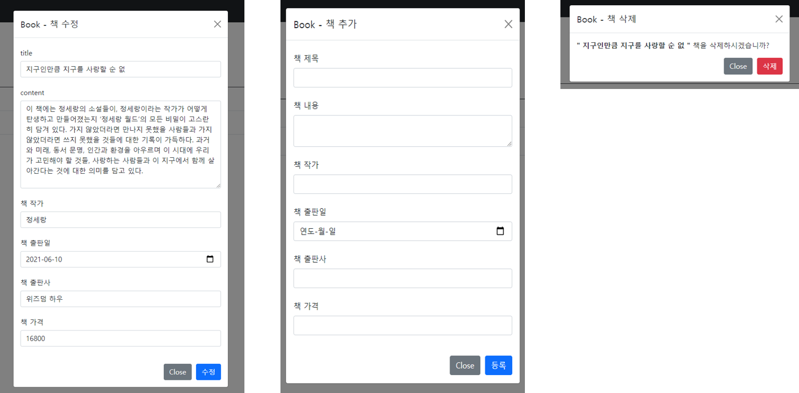

# 202112715_KYJ
## 📚 책 정보 페이지

### 🔗 Link
---

- 조회(GET)/추가(POST) <br>
AWS <http://15.165.131.181:3000/> 

- 수정 (PUT/:id) / 삭제 (DELETE/:id) <br>
POSTMAN <http://15.165.131.181:3000/:id>


<br>
</img>
</img>
<br>
<br>


<br>

####  ⚡통신규약
---

#### 📚 book 전체 조회
<br>

| URL | 메소드 | 
|:---:|:---:|
|/|GET|
<br>


| 메세지 구조 |  | | 
|:---|:---|:---| 
|msg| | 성공/실패 메세지| 
|data| | 책 입력 정보|
| | book_no | 책 번호 |
| | book_title | 책 제목 |
| | book_content | 책 내용 |
| | book_authors | 책 작가 |
| | book_date | 책 출판일 |
| | book_publisher | 책 출판사 |
| | book_price | 책 가격 |
<br>

> <b>메세지 예</b>
```json
{
    "msg": "select list success",
    "data": [
        {
            "book_no": 21,
            "book_title": "지구인만큼 지구를 사랑할 순 없",
            "book_content": "이 책에는 정세랑의 소설들이, 정세랑이라는 작가가 어떻게 탄생하고 만들어졌는지 ‘정세랑 월드’의 모든 비밀이 고스란히 담겨 있다. 가지 않았더라면 만나지 못했을 사람들과 가지 않았더라면 쓰지 못했을 것들에 대한 기록이 가득하다. 과거와 미래, 동서 문명, 인간과 환경을 아우르며 이 시대에 우리가 고민해야 할 것들, 사랑하는 사람들과 이 지구에서 함께 살아간다는 것에 대한 의미를 담고 있다.",
            "book_authors": "정세",
            "book_date": "2021-06-10",
            "book_publisher": "위즈덤 하우",
            "book_price": 16800
        },
        {
            "book_no": 22,
            "book_title": "그러라 그래",
            "book_content": "\"그러라 그래\", \"그럴 수 있어\" 어떤 근심도 툭 털어버리는 양희은의 말처럼, 이 책에는 '쉽지 않은 인생을 정성껏 잘 살아보고 싶게 만드는 애틋한 응원'이 담겨 있다. 좋아하는 걸 하고, 좋아하는 사람을 두고 나답게 살아가는 양희은의 인생 이야기를 전한다.",
            "book_authors": "양희은 ",
            "book_date": "2021-04-12",
            "book_publisher": "김영사 ",
            "book_price": 14500
        }
    ]
}
```

<br>

---
####  📚 book 선택 조회
<br>

| URL | 메소드 | 
|:---:|:---:|
|/:id|GET|
<br>


| 메세지 구조 |  | | 
|:---|:---|:---| 
|msg| | 성공/실패 메세지| 
|data| | 책 입력 정보|
| | book_no | 책 번호 |
| | book_title | 책 제목 |
| | book_content | 책 내용 |
| | book_authors | 책 작가 |
| | book_date | 책 출판일 |
| | book_publisher | 책 출판사 |
| | book_price | 책 가격 |
<br>

<b>메세지 예</b>
```json
{
    "msg": "select success",
    "data": {
        "book_no": 22,
        "book_title": "그러라 그래",
        "book_content": "\"그러라 그래\", \"그럴 수 있어\" 어떤 근심도 툭 털어버리는 양희은의 말처럼, 이 책에는 '쉽지 않은 인생을 정성껏 잘 살아보고 싶게 만드는 애틋한 응원'이 담겨 있다. 좋아하는 걸 하고, 좋아하는 사람을 두고 나답게 살아가는 양희은의 인생 이야기를 전한다.",
        "book_authors": "양희은 ",
        "book_date": "2021-04-12",
        "book_publisher": "김영사 ",
        "book_price": 14500
    }
}
```
---

#### 📚 book 추가
<br>

| URL | 메소드 | 
|:---:|:---:|
|/|POST|
<br>


| 메세지 구조 |  | | 
|:---|:---|:---| 
|msg| | 성공/실패 메세지| 
|data| | 책 입력 정보|
| | book_no | 책 번호 |
| | book_title | 책 제목 |
| | book_content | 책 내용 |
| | book_authors | 책 작가 |
| | book_date | 책 출판일 |
| | book_publisher | 책 출판사 |
| | book_price | 책 가격 |
<br>

<b>메세지 예</b>
```json
{
    "msg": "insert success",
    "data": {
        "book_no": 23,
        "book_title": "그러라 그래",
        "book_content": "\"그러라 그래\", \"그럴 수 있어\" 어떤 근심도 툭 털어버리는 양희은의 말처럼, 이 책에는 '쉽지 않은 인생을 정성껏 잘 살아보고 싶게 만드는 애틋한 응원'이 담겨 있다. 좋아하는 걸 하고, 좋아하는 사람을 두고 나답게 살아가는 양희은의 인생 이야기를 전한다.",
        "book_authors": "양희은 ",
        "book_date": "2021-04-12",
        "book_publisher": "김영사 ",
        "book_price": 14500
    }
}
```
---

####  📚 book 수정
<br>

| URL | 메소드 | 
|:---:|:---:|
|/:id|PUT|
<br>


| 메세지 구조 |  | | 
|:---|:---|:---| 
|msg| | 성공/실패 메세지| 
|data| | 책 입력 정보|
| | book_no | 책 번호 |
| | book_title | 책 제목 |
| | book_content | 책 내용 |
| | book_authors | 책 작가 |
| | book_date | 책 출판일 |
| | book_publisher | 책 출판사 |
| | book_price | 책 가격 |
<br>

<b>메세지 예</b>
```json
{
    "msg": "update success",
    "data": {
        "book_no": 23,
        "book_title": " [수정]",
        "book_content": "\"그러라 그래\", \"그럴 수 있어\" 어떤 근심도 툭 털어버리는 양희은의 말처럼, 이 책에는 '쉽지 않은 인생을 정성껏 잘 살아보고 싶게 만드는 애틋한 응원'이 담겨 있다. 좋아하는 걸 하고, 좋아하는 사람을 두고 나답게 살아가는 양희은의 인생 이야기를 전한다.",
        "book_authors": "양희은 ",
        "book_date": "2021-04-12",
        "book_publisher": "김영사 ",
        "book_price": 14500
    }
}
```
---

####  📚 book 삭제
<br>

| URL | 메소드 | 
|:---:|:---:|
|/:id|DELETE|
<br>


| 메세지 구조 |  | | 
|:---|:---|:---| 
|msg| | 성공/실패 메세지| 
|data| | 책 입력 정보|
| | book_no | 책 번호 |
<br>

<b>메세지 예</b>
```json
{
    "msg": "delete success",
    "data": "23"
}
```

<br>

####  ⚡ 데이터베이스 설계
---
<br>

|데이터 베이스| 
|:---:| 
|sys|
<br>

|테이블명| 
|:---:| 
|book|
<br>

|칼럼명|칼럼ID|타입(길이)| PK | NN |AI|비고| 
|:---|:---:|:---|:---:|:---|:---:|:---:| 
|책 번호|book_no|int(11)|O|O|O| | 
|책 제목|book_title|varchar(255)||O|| | 
|책 내용|book_content|varchar(255)|||| | 
|책 작가|book_authors|varchar(255)|||| | 
|책 출판사|book_publisher|varchar(255)|||| | 
|책 출판일|book_date|date|||| yyyy-mm-dd| 
|책 가격|book_price|int(11)|||| | 
<br>

